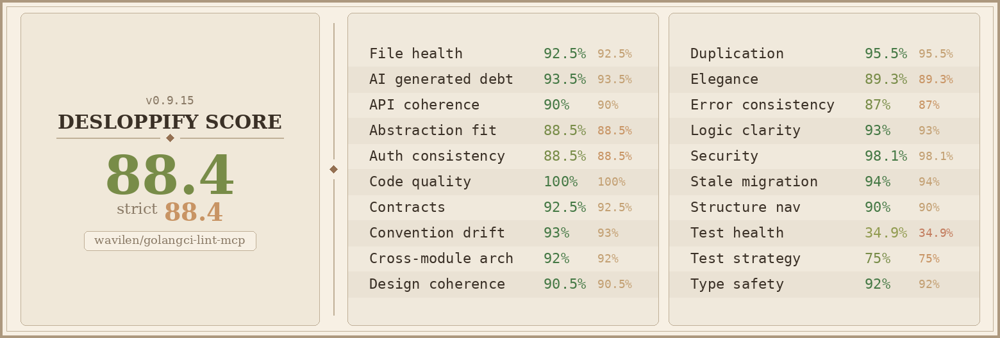

# golangci-lint-mcp

An MCP server that provides AI agents with concise, actionable guidance for fixing golangci-lint issues.

When an agent encounters a golangci-lint diagnostic, it can call a single tool and immediately understand what the issue means and how to fix it — no web search, no guessing.

## What It Does

Provides two MCP tools (three when gosec AI is configured):

- **`golangci_lint_guide`** — accepts a linter name and optional rule ID, returning XML-tagged guidance with `<instructions>`, `<examples>`, `<patterns>`, and `<related>` sections.
- **`golangci_lint_parse`** — accepts raw golangci-lint JSON output and returns fix guidance for all unique (linter, rule) pairs in a single call. Ideal for bulk diagnostics — no need to call the guide tool once per issue.
- **`gosec_ai_autofix`** *(conditional)* — runs gosec with AI-powered autofix on a file or directory. Only available when `--gosec-ai` flag is enabled and `GOSEC_AI_API_KEY` environment variable is set.

Covers all linters bundled by golangci-lint with **629 guides total**:

- ~103 simple linter guides (one per linter)
- ~526 compound linter rule guides:
  - staticcheck: 172 rules (SA/S/ST/QF codes)
  - gocritic: 108 checkers
  - revive: 101 rules
  - gosec: 61 rules (G-codes)
  - govet: 35 analyzers
  - testifylint: 20 rules
  - modernize: 10 rules
  - ginkgolinter: 12 rules
  - grouper: 4 rules
  - errorlint: 3 rules

**Compound linters** (gocritic, gosec, revive, staticcheck, govet, and others) accept a `rule` parameter for per-diagnostic guidance. Simple linters just need the `linter` name.

Uses **stdio transport** — designed for MCP clients like opencode, Claude Desktop, and Cursor.

## Installation

### From source (recommended)

```bash
go install github.com/wavilen/golangci-lint-mcp@latest
```

This places the `golangci-lint-mcp` binary in `$GOPATH/bin`. Make sure your Go bin directory is in your `PATH`. The version is derived automatically from the git tag via Go's built-in VCS info.

### Build locally

```bash
git clone <repo-url>
cd golangci-lint-mcp
make install
```

This installs with the exact version from `git describe --tags` injected via ldflags. Use `make build` to build locally without installing.

### Install the OpenCode Skill

**One-command install (recommended):**

```bash
npx golangci-lint-guide
```

**Or install globally:**

```bash
npm install -g golangci-lint-guide
golangci-lint-guide
```

**Or from source:**

```bash
make install-skill
```

This copies the golangci-lint-guide skill to `~/.agents/skills/golangci-lint-guide/`, making it available in any Go project opened with opencode.

## Compatibility

This server ships guides validated against **golangci-lint v2.0+**.

**golangci-lint v1.x is incompatible** — it uses completely different CLI flags and will not work with this server.

At startup, the server checks your installed golangci-lint version and logs a warning if:
- The version is below v2.0 (incompatible — wrong CLI flags)
- The version is significantly newer (6+ minor versions ahead) — some linters may have changed behavior compared to when the guides were written

The version check is non-blocking — the server starts normally regardless of the result. Warnings appear in stderr logs, visible in MCP client debug output.

### Versioning

The server reports its own version at startup and to MCP clients. The version is derived from git tags:

- **`go install @latest`** — version comes from Go's built-in VCS info (`vcs.tag` build setting)
- **`make install`** — version injected via ldflags from `git describe --tags`
- **Development builds** — falls back to commit hash or `"dev"`

To sync `package.json` with the latest git tag:

```bash
make sync-version
```

## MCP Client Configuration

### opencode

Add to your project's `opencode.json`:

```json
{
  "$schema": "https://opencode.ai/config.json",
  "mcp": {
    "golangci-lint": {
      "type": "local",
      "command": ["golangci-lint-mcp"]
    }
  }
}
```

The plugin automatically injects `--output.json.path stdout` into any `golangci-lint` command and strips conflicting output format flags (e.g., `--output.text.*`, `--out-format`, `--verbose`, `--show-stats`) that would break JSON parsing. No manual flag management needed.

If the binary is not in PATH, use the full path:

```json
{
  "$schema": "https://opencode.ai/config.json",
  "mcp": {
    "golangci-lint": {
      "type": "local",
      "command": ["/path/to/golangci-lint-mcp"]
    }
  }
}
```

### Claude Desktop

Add to `~/Library/Application Support/Claude/claude_desktop_config.json` (macOS) or `%APPDATA%\Claude\claude_desktop_config.json` (Windows):

```json
{
  "mcpServers": {
    "golangci-lint": {
      "command": "golangci-lint-mcp"
    }
  }
}
```

### Cursor

Add to `.cursor/mcp.json` in your project root:

```json
{
  "mcpServers": {
    "golangci-lint": {
      "command": "golangci-lint-mcp"
    }
  }
}
```

### With --gosec-ai flag (optional)

To enable gosec AI autofix, add the flag and configure the required environment variables:

**opencode:**

```json
{
  "$schema": "https://opencode.ai/config.json",
  "mcp": {
    "golangci-lint": {
      "type": "local",
      "command": ["golangci-lint-mcp", "--gosec-ai"],
      "env": {
        "GOSEC_AI_API_PROVIDER": "gemini-2.0-flash",
        "GOSEC_AI_API_KEY": "your-api-key-here"
      }
    }
  }
}
```

**Claude Desktop / Cursor:**

```json
{
  "mcpServers": {
    "golangci-lint": {
      "command": "golangci-lint-mcp",
      "args": ["--gosec-ai"],
      "env": {
        "GOSEC_AI_API_PROVIDER": "gemini-2.0-flash",
        "GOSEC_AI_API_KEY": "your-api-key-here"
      }
    }
  }
}
```

#### Environment Variables

| Variable | Required | Description |
|----------|----------|-------------|
| `GOSEC_AI_API_KEY` | Yes | API key for the AI provider. The `gosec_ai_autofix` tool is only registered when this is set. |
| `GOSEC_AI_API_PROVIDER` | No | AI provider/model (default: `gemini-2.0-flash`). Options: `gemini-2.0-flash`, `claude-sonnet-4-0`, `gpt-4o`, or a custom model name. |
| `GOSEC_AI_BASE_URL` | No | Custom base URL for the AI provider API endpoint. |
| `GOSEC_AI_SKIP_SSL` | No | Set to `"true"` to skip SSL verification for the AI provider connection. |

#### How It Works

The API key is passed directly to the gosec subprocess by the MCP server — it is **never exposed in tool responses**. The `gosec_ai_autofix` tool is only available when both `--gosec-ai` and `GOSEC_AI_API_KEY` are configured. When enabled, gosec guide responses include an `<autofix>` section pointing to the `gosec_ai_autofix` MCP tool instead of hardcoded CLI commands.

## Usage Examples

### Simple linter

Query `errcheck` → get guidance on handling unchecked error returns. The response includes what the issue means, a code example showing the fix pattern, and related linters.

### Compound linter with rule

Query `gocritic` with rule `appendAssign` → get specific guidance on the appendAssign checker, including before/after code examples and the fix pattern.

### Compound linter without rule

Query `staticcheck` without a rule → server responds with a list of all ~172 available rule codes (SA1000, SA1001, ...), prompting you to specify one.

### Parse bulk JSON output

Pass raw `golangci-lint run --output.json.path stdout` output to `golangci_lint_parse` → get fix guidance for every unique diagnostic in one response. Deduplicates identical (linter, rule) pairs automatically.

### Unknown linter

Query `errchek` → server suggests "Did you mean \"errcheck\"?" using fuzzy matching.

## OpenCode Skill

The `/golangci-lint-guide` skill teaches agents the full fix workflow. Install it with:

```bash
npx golangci-lint-guide
```

Or from source: `make install-skill`

When an agent runs `/golangci-lint-guide`, it follows the structured workflow:

1. Run `golangci-lint run --output.json.path stdout ./...` to get all diagnostics (the opencode plugin strips conflicting output flags automatically)
2. Call the MCP tool `golangci_lint_parse` with the raw JSON output to get fix guidance for all diagnostics at once (or call `golangci_lint_guide` per diagnostic for individual lookups)
3. Apply fixes per package, re-running golangci-lint after each package
4. Final verification with `golangci-lint run ./...`

## Architecture

**Single binary:** All 629 guides are embedded via `go:embed` at compile time. No external files, no database, no network calls. The binary is self-contained.

**MCP server:** Built with the mcp-go framework (v0.48.0). Uses stdio transport — reads JSON-RPC from stdin, writes to stdout. Exposes two tools: `golangci_lint_guide` (per-diagnostic lookup) and `golangci_lint_parse` (bulk JSON parsing).

**OpenCode plugin:** The `plugins/golangci-lint.js` plugin hooks into `tool.execute.before` to strip 20+ conflicting output format flags (`--output.text.*`, `--output.tab.*`, `--out-format`, `--verbose`, `--show-stats`, legacy flags, etc.) and inject `--output.json.path stdout` — ensuring the MCP server always receives clean JSON. It also hooks into `tool.execute.after` to nudge agents toward using MCP tools when diagnostics are found.

**Guide store:** In-memory index loaded at startup from the embedded filesystem. Lookup by key is O(1). Keys are formatted as `linter` for simple linters and `linter/rule` for compound linter rules.

**Guide format:** XML-tagged markdown files with `<instructions>`, `<examples>`, `<patterns>`, and `<related>` sections. Simple guides: ≤200 words. Compound guides: ≤500 words.

**Compound linters:** Subdirectories under `guides/` contain per-rule markdown files (e.g., `guides/gocritic/appendAssign.md`, `guides/gosec/G101.md`, `guides/staticcheck/SA1000.md`).

## Contributing

### Guide structure

- Guide files live in the `guides/` directory
- **Simple linters:** one `.md` file per linter in `guides/` (e.g., `guides/errcheck.md`)
- **Compound linters:** one `.md` file per rule in `guides/<linter>/` (e.g., `guides/gocritic/appendAssign.md`)
- Follow the template in `guides/_template.md`

### Word limits

- Simple guides: ≤200 words
- Compound linter rule guides: ≤500 words

### Validation

All guides must pass `go test ./...` which validates structure, word limits, and formatting. Run tests before submitting:

```bash
go test ./...
```

## Code Quality



## License

MIT License — see LICENSE file for details.
