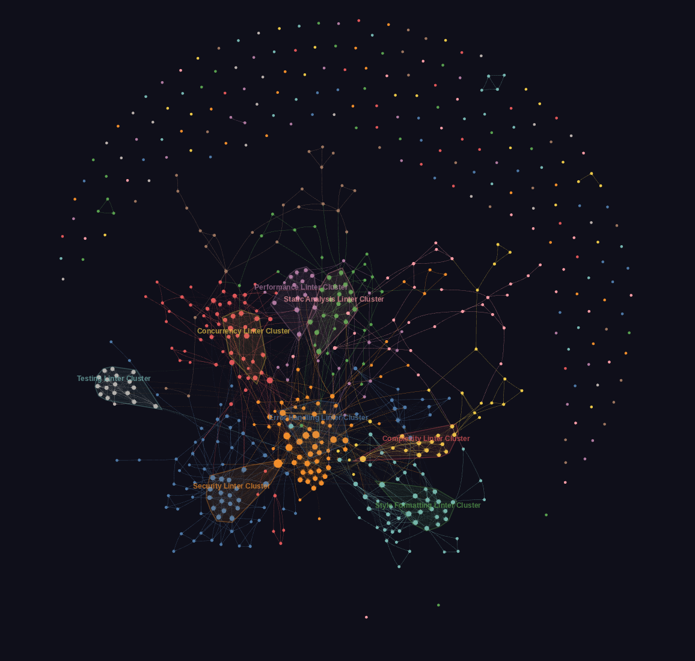
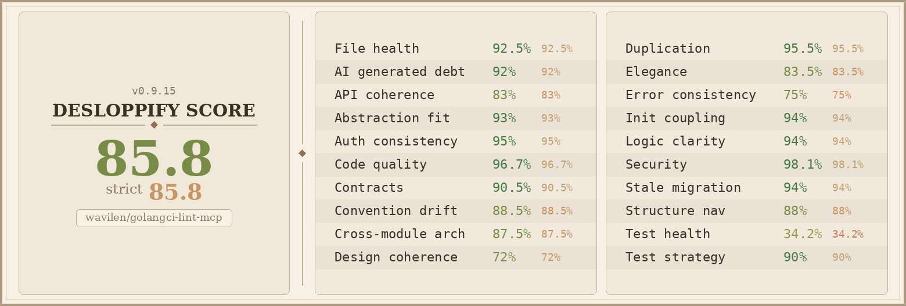

# golangci-lint-mcp

An MCP server that provides AI agents with concise, actionable guidance for fixing golangci-lint issues.

## Why This Project Exists

When AI coding agents encounter golangci-lint diagnostics, they don't just fail to fix them — they actively make things worse. They suppress warnings with `//nolint` comments, make shotgun changes to `.golangci.yml` that disable linters entirely, or introduce new issues while attempting multi-iteration fixes. Web searches return generic advice. The agent guesses, iterates, and each attempt risks creating more problems. This project solves that: one tool call gives the agent specific, actionable guidance with instructions, examples, patterns, and related issues — no search, no guessing.

## Quick Start

1. **Install:** `go install github.com/wavilen/golangci-lint-mcp@latest`
2. **Configure** — add to your project's `opencode.json`:

```json
{
  "$schema": "https://opencode.ai/config.json",
  "mcp": {
    "golangci-lint": {
      "type": "local",
      "command": ["golangci-lint-mcp"]
    }
  }
}
```

3. **Run:** Call `golangci_lint_run(path="./...")` — get fix guidance in one response.

For other clients (Claude Desktop, Cursor) see [Configuration](docs/configuration.md). For build-from-source see [Installation](docs/installation.md).

## Features

- **`golangci_lint_run`** — Run golangci-lint and get fix guidance in one call. Primary entry point.
- **`golangci_lint_parse`** — Parse existing golangci-lint JSON output into fix guidance.
- **`golangci_lint_guide`** — Per-diagnostic lookup by linter and optional rule ID.
- **`golangci_lint_list`** — Discover all supported linters with classification and rule counts.
- **`golangci_lint_summarize`** — Strategy summary of raw JSON output.

**629 guides** covering all golangci-lint linters: staticcheck (172 rules), gocritic (108 checkers), revive (101 rules), gosec (61 rules), govet (35 analyzers), testifylint (20 rules), and more. Compound linters accept a `rule` parameter for per-diagnostic guidance.

Uses **stdio transport** — compatible with opencode, Claude Desktop, and Cursor.

## gosec AI Autofix (optional)

The `gosec_ai_autofix` tool runs gosec with AI-powered autofix. Enable it with the `--gosec-ai` flag and set environment variables:

**opencode:**

```json
{
  "mcp": {
    "golangci-lint": {
      "type": "local",
      "command": ["golangci-lint-mcp", "--gosec-ai"],
      "env": {
        "GOSEC_AI_API_PROVIDER": "gemini-2.0-flash",
        "GOSEC_AI_API_KEY": "your-api-key-here"
      }
    }
  }
}
```

| Variable | Required | Description |
|----------|----------|-------------|
| `GOSEC_AI_API_KEY` | Yes | API key for the AI provider. Tool only available when set. |
| `GOSEC_AI_API_PROVIDER` | No | Provider/model (default: `gemini-2.0-flash`). |
| `GOSEC_AI_BASE_URL` | No | Custom base URL for the AI provider API. |
| `GOSEC_AI_SKIP_SSL` | No | Set to `"true"` to skip SSL verification. |

The API key is passed directly to the gosec subprocess — never exposed in tool responses. For Claude Desktop/Cursor config examples, see [Configuration](docs/configuration.md).

## Usage Examples

### Run and get guidance

Call `golangci_lint_run(path="./pkg/auth/...")` → runs golangci-lint on the package, returns per-package fix guidance with instructions, examples, patterns, and Related Context for related issues.

### Full project scan

Call `golangci_lint_run(path="./...")` → returns a package breakdown with strategy recommendation. When >30 issues are found, the strategy recommends subagent-per-package for efficient fixing.

### Discover linters

Call `golangci_lint_list()` → returns all supported linters with compound/simple classification and rule counts. Useful for understanding which linters require a `rule` parameter.

### Parse existing JSON

Pass raw golangci-lint JSON output to `golangci_lint_parse(output="<json>")` → get fix guidance for every unique diagnostic in one response. Deduplicates identical (linter, rule) pairs automatically.

### Per-diagnostic lookup

Query `golangci_lint_guide(linter="errcheck")` → get guidance on handling unchecked error returns. For compound linters, add the rule: `golangci_lint_guide(linter="gocritic", rule="appendAssign")`.

### Unknown linter

Query `errchek` → server suggests "Did you mean \"errcheck\"?" using fuzzy matching.

## OpenCode Skill

The `/golangci-lint-guide` skill teaches agents the `golangci_lint_run`-first workflow. Install it with:

```bash
npx @wavilen/golangci-lint-guide
```

Or from source: `make install-skill`

When an agent activates the skill, it follows the structured workflow:

1. Call `golangci_lint_run` with a package path to run golangci-lint and get fix guidance in one step
2. Apply fixes per package, using the provided instructions, patterns, and examples
3. Fix related issues highlighted in Related Context — they're in the same package
4. Verify by calling `golangci_lint_run` again — expect "No issues found"
5. For >30 issues: use subagent-per-package strategy (each package gets its own full-context agent)

## Architecture

**Single binary:** All 629 guides are embedded via `go:embed` at compile time. No external files, no database, no network calls. The binary is self-contained.

**MCP server:** Built with the mcp-go framework (v0.48.0). Uses stdio transport — reads JSON-RPC from stdin, writes to stdout. Exposes five tools: `golangci_lint_run` (run + parse + guide in one call), `golangci_lint_parse` (bulk JSON parsing), `golangci_lint_guide` (per-diagnostic lookup), `golangci_lint_list` (linter discovery), and `golangci_lint_summarize` (strategy summary).

**OpenCode plugin:** The `plugins/golangci-lint.js` plugin hooks into `tool.execute.before` to strip 20+ conflicting output format flags (`--output.text.*`, `--output.tab.*`, `--out-format`, `--verbose`, `--show-stats`, legacy flags, etc.) and inject `--output.json.path stdout` — ensuring the MCP server always receives clean JSON. It also hooks into `tool.execute.after` to nudge agents toward using MCP tools when diagnostics are found.

**Guide store:** In-memory index loaded at startup from the embedded filesystem. Lookup by key is O(1). Keys are formatted as `linter` for simple linters and `linter/rule` for compound linter rules.

**Guide format:** XML-tagged markdown files with `<instructions>`, `<examples>`, `<patterns>`, and `<related>` sections. Simple guides: ≤200 words. Compound guides: ≤500 words.

**Compound linters:** Subdirectories under `guides/` contain per-rule markdown files (e.g., `guides/gocritic/appendAssign.md`, `guides/gosec/G101.md`, `guides/staticcheck/SA1000.md`).

## Linter Relationship Graph

Graphify analyzed relationships across all 629 guide files, discovering 10 labeled communities and 2232 edges connecting related diagnostics. The communities map to Error Handling, Security, Complexity, Testing, Style, Concurrency, Performance, and Static Analysis clusters.



[Explore the interactive graph →](https://wavilen.github.io/golangci-lint-mcp/graph.html)

## Contributing

### Guide structure

- Guide files live in the `guides/` directory
- **Simple linters:** one `.md` file per linter in `guides/` (e.g., `guides/errcheck.md`)
- **Compound linters:** one `.md` file per rule in `guides/<linter>/` (e.g., `guides/gocritic/appendAssign.md`)
- Follow the template in `guides/_template.md`

### Word limits

- Simple guides: ≤200 words
- Compound linter rule guides: ≤500 words

### Validation

All guides must pass `go test ./...` which validates structure, word limits, and formatting. Run tests before submitting:

```bash
go test ./...
```

## Code Quality



## License

MIT License — see LICENSE file for details.
